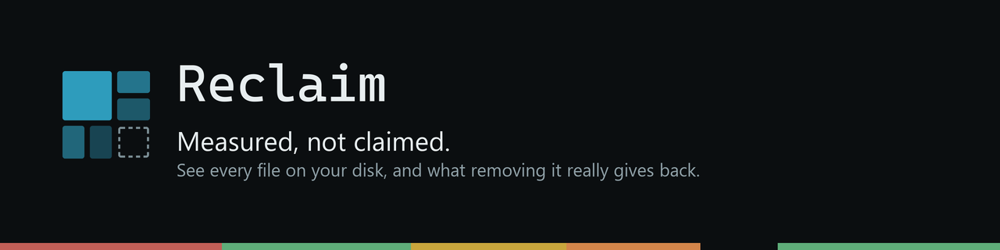

<div align="center">



**See what is actually reclaimable on your disk, and what each removal costs to undo.**

A small, fast disk cleaner for Windows that refuses to lie to you about numbers.

**Nothing is deleted unless you ask for it by name.** What you select is moved aside with a manifest, and one button puts it back.

<br>

[](../../releases/latest)
[](../../releases/latest)
[](https://polyformproject.org/licenses/noncommercial/1.0.0/)

<!-- Swap the first badge for these two once a release exists. Until then they
     render as red "NO RELEASES FOUND", which on a download page reads as the
     product being broken rather than as the page being early.

[](../../releases/latest)
[](../../releases)
-->


</div>

---

## Why another disk cleaner

Because every one I could find gets the same two things wrong.

**It sums file sizes and calls that your saving.** That is not what the volume gives back. Both of these were measured on one real machine, and no tool warned about either:

| Directory | What summing file sizes claims | What deleting it actually returned |
| --- | --- | --- |
| Steam download staging | 61.4 GB | **22.1 GB** |
| Unity `Library` caches across 24 backups | 93.3 GB | **95.3 GB** |

The first is sparse preallocation: Steam creates its download targets at full size before writing a byte into them. The second is cluster slack, hundreds of thousands of tiny files each rounding up. The error runs in both directions, which is why you cannot correct for it by being suspicious of large numbers.

**It answers the wrong question.** "Is this safe to delete?" is not actionable, because almost everything technically is. The question that decides anything is *what does it cost me to get this back*, and that ranges from nothing at all to gone for good.

## What you get

Every folder on the volume, sized by what it actually occupies and coloured by the decision it asks of you.

| | |
| --- | --- |
| 🟩 **Green** | Just do it. Temp files, crash dumps, finished update payloads, interrupted downloads. |
| 🟨 **Yellow** | Do it, the next load is slower. Package caches, shader caches, browser caches, build output. |
| 🟧 **Orange** | Yours, your call. Disc images, downloaded installers, backups, exports, mods. Never selected for you. |
| 🟥 **Red** | Leave alone. System files, projects, saves, credentials, installed software. |

Every byte falls into exactly one of these, so the four add up to the whole disk rather than to a list of interesting places.

**Anything no rule recognises is Red.** A classifier that guesses "probably junk" about unfamiliar paths eventually meets somebody's irreplaceable folder and is confidently wrong about it. Being useless about an unknown directory costs nothing. Being wrong costs everything.

**Every finding explains itself.** Expand a row and it says what the evidence is and what the removal costs, in plain words. A cleaner that cannot say why it wants to delete something is a cleaner you should not trust.

## Download

Latest build on [**Releases**](../../releases/latest). Windows 10 or 11, x64. Free for personal use.

| | |
| --- | --- |
| **Portable ZIP** | Unpack it and run `reclaim.exe`. Nothing is installed, nothing touches the registry, and deleting the folder removes every trace. Take this one if you would rather not let an unfamiliar program install itself before you have decided whether you trust it. |
| **MSI installer** | An ordinary Windows install with a Start menu entry. The only one of the two that can update itself. |

Run it as administrator if you can. Without those rights it cannot open the file table and falls back to walking directories: identical numbers, minutes instead of seconds.

## Windows will warn you

SmartScreen will say the publisher is unrecognised. That is true, and it is about the absence of a code signing certificate rather than about anything found inside the file. Click *More info*, then *Run anyway*.

If you would rather check first, every release lists SHA-256 hashes:

```powershell
Get-FileHash .\Reclaim_x64_en-US.msi -Algorithm SHA256
```

Updates are separately signed with a key that never leaves the build machine, and the application refuses any update whose signature does not verify. That signature is not a code signing certificate and does nothing about the warning above.

## Reporting something

Open an [issue](../../issues). The useful ones say which drive, what Reclaim claimed, and what actually happened.

**A rule that classifies something wrongly is worth reporting even when nothing was deleted.** The classification decides what gets offered in the first place, so a wrong colour is the bug and a deletion would only ever be the symptom.

<div align="center">
<br>

This repository holds releases and nothing else. The source is private.

<sub>Free for personal use under <a href="https://polyformproject.org/licenses/noncommercial/1.0.0/">PolyForm Noncommercial 1.0.0</a>. Commercial use needs a licence.</sub>

</div>
